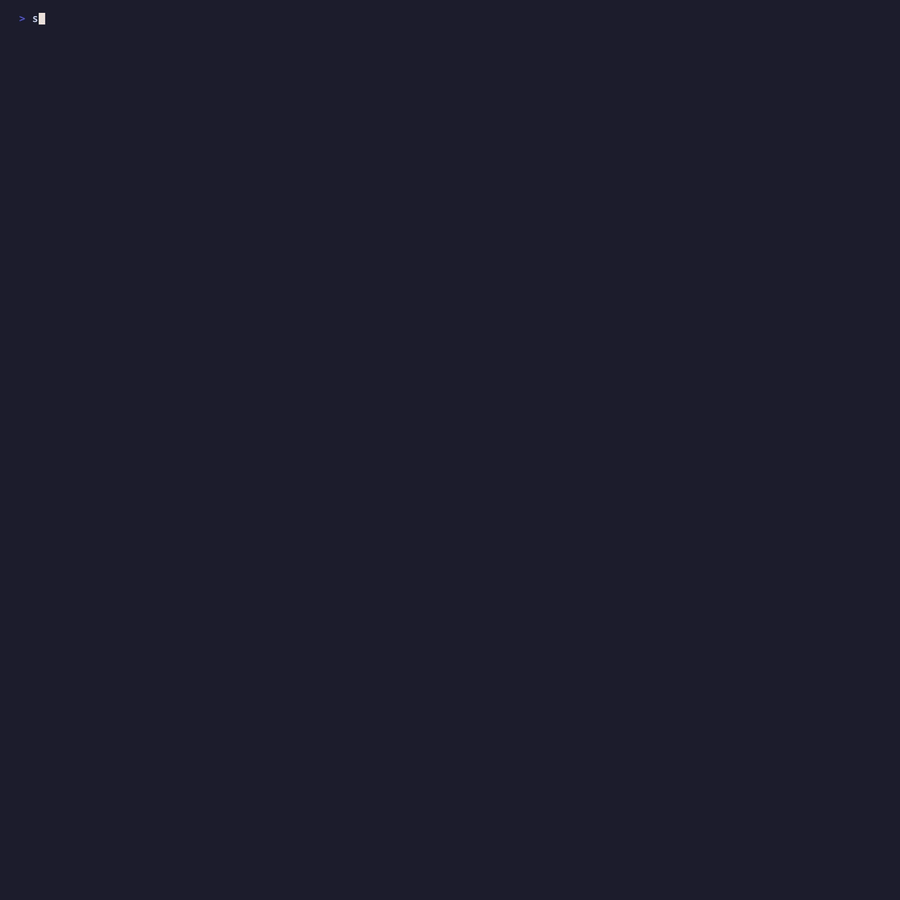

# [BÜYÜK GÜNCELLEME] Son 12 Günde 77 Commit — Tam Değişiklik Listesi

İlk paylaşımdan bu yana aracın neredeyse her modülü değişti.  
**400 dosya · 49.000+ satır · 77 commit**

---

## 🔬 Model Artifact Scanner — En Çok Gelişen Alan

### Yeni Format Desteği (24 → 28 Format)

| Format | Uzantılar | Ne Tespit Ediyor |
|---|---|---|
| **TensorRT** | `.engine` `.plan` `.trt` | Gömülü PE/ELF ikili, `LoadLibrary`, TRT plugin entry point |
| **ExecuTorch** | `.pte` `.ptl` | FlatBuffers doğrulama, ZIP içi pickle, `eval`/`exec` string |
| **Torch7/Lua** | `.t7` `.th` `.net` | Lua `loadstring`/`ffi.load`, LOLBin, ağ bağlantısı |
| **Model Card** | `.md` `.rst` `.txt` | README'lerde credential sızıntısı, injected code (9 kural) |

### Pickle — 3 Katmanlı Derinlik

**Katman 1 — CVE-2026-24747 Object Mutation**
- `ARTIFACT-042`: `REDUCE→SETITEM` heap mutasyonu
- `ARTIFACT-043`: `NEWOBJ→SETITEMS` attribute injection

**Katman 2 — Sliding-Window Opcode Zincir Analizi**

Blocklist tek opcode'a bakar; bu katman kombinasyonlara bakar:

| Kural | Seviye | Pattern | Açıklama |
|---|---|---|---|
| PICKLE-SEQ-003 | 🔴 CRITICAL | `REDUCE→GLOBAL→REDUCE` | Gadget chain |
| PICKLE-SEQ-004 | 🟠 HIGH | `INST→REDUCE` | Class instantiation saldırısı |
| PICKLE-SEQ-005 | 🔴 CRITICAL | `GLOBAL→REDUCE→SETITEM` | Tensor rebuild + dict mutation |
| PICKLE-SEQ-006 | 🟠 HIGH | `NEWOBJ→SETITEMS` | Bulk attribute injection |
| PICKLE-SEQ-007 | 🔴 CRITICAL | `STRING→GLOBAL→REDUCE` | String sabit değeri ile kod enjeksiyonu |
| PICKLE-SEQ-008 | 🟠 HIGH | `DUP→GLOBAL→REDUCE` | Stack duplication obfuscation |

**Katman 3 — PDB tam kapsama** + operator gadget chain CRITICAL + `.data` uzantısı desteği

### Yeni Scanner'lar

- `cntk_scanner.py` — CNTK `.dnn`/`.cmf` — 14 kural, %0 FP, 10/10 malicious tespiti
- `auto_map_ast_analyzer.py` — Auto-mapping RCE
- `binary_tail_scanner.py` — Dosya sonuna gömülü veri
- `gpu_abuse_detector.py` — GPU kaynak istismarı
- `jinja2_scanner.py` — Jinja2 SSTI
- `prompt_injection_analyzer.py` — Model içine gömülü prompt injection
- `r_serialized_scanner.py` — R `.rds`/`.rdata`
- `rar_scanner.py` — RAR arşivi tarama
- `rknn_scanner.py` — Rockchip NPU model formatı
- `skops_scanner.py` — scikit-learn SKOPS
- `torchserve_scanner.py` — TorchServe MAR arşivi
- `trojan_detector.py` — Trojan model tespiti
- `tf_metagraph_scanner.py` — TensorFlow metagraph
- `xgboost_scanner.py` — XGBoost model

### YAML Scanner — CVE-2025-23304

Hydra/OmegaConf konfigürasyonlarında `_target_` alanı `hydra.utils.instantiate()` tarafından çalıştırılır.  
`_target_: os.system` gibi değerler → **ARTIFACT-044 CRITICAL**

### Ağırlık Analizi — WEIGHT-006

Cosine similarity ile backdoor nöron tespiti.  
GPT-2 (50.257), BERT (30.522), LLaMA (32.000) embedding katmanları otomatik atlanır → sıfır FP büyük modellerde.

---

## 🛡️ Prompt Firewall — Yeni Dedektörler

`MultiTurnTracker`'a eklenenler:

- **Crescendo** — Kademeli kötüye kullanma (adım adım sınır zorlama)
- **Many-shot jailbreak** — Yüzlerce örnek ile bağlam manipülasyonu
- **Persona persistence** — Saldırgan karakter tutma ("sen artık X'sin")
- **Payload fragmentation** — Bölünmüş saldırı parçaları
- **Turn velocity** — Hız anomalisi tespiti

\+ 14 yeni firewall pattern, 4 FP düzeltmesi, 14 bypass hardening

---

## ⚔️ Red Team / Eval — 2x Büyüdü

### Yeni Probe Modülleri (20+)

`ascii_smuggling` · `audio_attack` · `benchmark_probes` · `competitors` · `contracts` · `debug_access` · `divergent_repetition` · `excessive_agency` · `genetic` · `hallucination` · `historical_academic` · `image_attack` · `imitation` · `industry_expanded` · `many_shot` · `overreliance` · `pair_probe` · `persuasion` · `shell_injection` · `ssrf` · `thought_experiment` · `word_game`

### Yeni Saldırı Stratejileri (10)

`best_of_n` · `chunked_request` · `crescendo` · `flip_attack` · `gcg` · `homoglyph` · `skeleton_key` · `stego` · `stratasword` · `tree_search`

### Diğer

- PDF rapor çıktısı
- Multi-model karşılaştırma modu
- HuggingFace dataset registry
- Playbook versiyonlama

---

## 🔍 SAST — İnterprosedürel Analiz

- **10 dil desteği**: Python, Go, Java, JavaScript, TypeScript, PHP, Ruby, Rust, C#, Kotlin
- **İnterprosedürel taint tracking** — Fonksiyon sınırları arasında kirli veri takibi
- f-string, walrus operatörü (`:=`), `AugAssign` desteği
- Paralel artifact tarama
- `risk_score` çıktısı eklendi

---

## 🤖 Agent / MCP Güvenliği

Yeni modüller:

| Modül | Açıklama |
|---|---|
| `a2a_scanner.py` | Agent-to-agent iletişim güvenliği |
| `admission_gate.py` | Giriş kapısı kontrolü |
| `mcp/api_analyzer.py` | MCP API analizi |
| `mcp/scorecard.py` | MCP güvenlik skoru |
| `cascading_hallucination.py` | Hallucination zincirleri |
| `cross_contamination.py` | Çapraz agent kontaminasyon |
| `decision_drift_monitor.py` | Karar sapması izleme |
| `memory_poisoning.py` | Bellek zehirleme tespiti |
| `yara_analyzer.py` | YARA kural motoru entegrasyonu |

---

## 📦 AIBOM — Genişletildi

- Container image tarama
- Multi-dil bağımlılık grafiği
- AIBOM diff karşılaştırma
- Uyumluluk kontrolü (`compliance.py`)

---

## 🏗️ Altyapı

- **Native binary** — PyInstaller, Windows/macOS/Linux tek dosya `.exe`/`.bin`
- **Rust pickle wheel** — Bağımsız paket
- **SQLite observability store** — Audit log ve tarama geçmişi
- **YARA motoru** — `data_exfiltration.yar` + `model_artifact_threats.yar`
- **GitHub Issue şablonları** — Bug, FP, feature request formları

---

## 📊 Rakamsal Özet

| Metrik | İlk Paylaşım | Şu An |
|---|---|---|
| Test sayısı | 811 | **1263** |
| Desteklenen format | 24 | **28** |
| Red team probe | ~28 | **50+** |
| Red team strateji | ~4 | **14** |
| SAST dil desteği | 1 (Python) | **10** |
| Pickle tespit katmanı | blocklist | **blocklist + CVE + zincir analizi** |
| Commit (12 gün) | — | **77** |
| Değişen dosya | — | **400** |

---

**GitHub:** https://github.com/EresusSecurity/Eresus-sentinel
